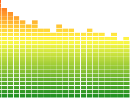

# Sample audio frequency visualizer

[Demo](https://vsdizzy.github.io/audio-freq-sample)

Should work in `Chrome`, `Firefox`, `Edge`.

Will not work in `Internet Explorer` because it does not support `AudioContext`.

## The Idea

To compose bars programmatically:

- draw the gradient bar: 
- draw the mask: 
- scale up the bar and mask it using `svg` and pattern

The result:

Then just copy corresponding pixels to the target canvas.
